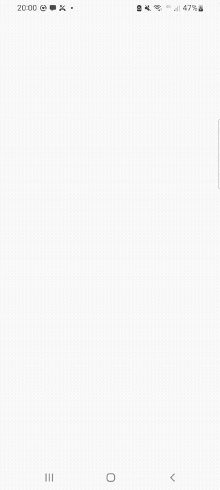

# app-crypto-exchanges

[](https://github.com/tihasg/app-crypto-exchanges/actions/workflows/ci.yml)

Aplicativo Android que consulta a API da [CoinMarketCap](https://coinmarketcap.com/api/documentation/v1/)
e exibe uma lista de exchanges de criptomoedas e, ao tocar em uma delas, seus detalhes junto das
moedas negociadas. Construído com Kotlin, Jetpack Compose, MVI e Clean Architecture, separada em
módulos Gradle.

## Demo

| Tema claro | Tema escuro |
|---|---|
|  |  |

Vídeos originais em qualidade completa: [`video/tema-light.mp4`](video/tema-light.mp4) e
[`video/tema-dark.mp4`](video/tema-dark.mp4).

## Setup

1. Copie `local.properties.example` para `local.properties` (arquivo ignorado pelo git).
2. Preencha `sdk.dir` com o caminho do seu Android SDK.
3. Preencha `CMC_API_KEY` com uma chave da [CoinMarketCap Pro API](https://pro.coinmarketcap.com/account).
   A chave nunca é versionada: ela é lida de `local.properties` em tempo de build e exposta via
   `BuildConfig.CMC_API_KEY`, consumida só dentro dos módulos `di`/`data` — nunca logada.
4. **`/v1/exchange/market-pairs/latest`** (usado só na tela de detalhe, pra listar as moedas) pode
   retornar 403 (`error_code 1006`) num plano que não suporte o endpoint. `/v1/exchange/map` e
   `/v1/exchange/info` (usados na listagem) funcionam numa chave Basic (gratuita). Se
   `market-pairs/latest` falhar (403 por plano, timeout, etc.), a tela de detalhe degrada para
   lista de moedas vazia em vez de falhar inteira.

## Arquitetura

Clean Architecture (domain → data → presentation) + MVI na presentation, separada em módulos
Gradle independentes:

```
                        ┌────────────────────────────────────────┐
                        │                  app                    │
                        │  presentation/  (Compose + ViewModels)  │
                        │  di/            (Koin modules)          │
                        │  navigation/    (Navigation Compose)    │
                        └───────┬───────────────────┬─────────────┘
                                │                   │
                    depends on ▼                   ▼ depends on
                    ┌───────────────┐       ┌───────────────┐
                    │     data       │──────▶│    domain      │
                    │ DTOs, mappers, │  uses │ entities,      │
                    │ RemoteDataSrc, │ repo  │ DomainError,   │
                    │ RepositoryImpl │ contr.│ use cases,     │
                    │                │       │ repo contracts │
                    └───────┬────────┘       └───────────────┘
                            │ uses                    ▲
                            ▼                          │ (no dependency)
                    ┌───────────────┐                  │
                    │ core-network   │                  │
                    │ Retrofit/OkHttp│                  │
                    │ factories,     │                  │
                    │ safeApiCall,   │                  │
                    │ NetworkResult  │                  │
                    └───────────────┘

        app also depends directly on core-ds (Compose design system, leaf module,
        no dependency on domain/data/network).
```

- **`domain`** — Kotlin/JVM puro. Entidades (`Exchange`, `ExchangeDetail`, `Currency`), `DomainError`
  selado, `DomainResult<T>` (Success/Error, nunca uma exceção crua), interfaces de repositório e
  use cases (`GetExchangesUseCase`, `GetExchangeDetailUseCase`). Zero import de Android, Retrofit,
  Koin ou qualquer framework.
- **`data`** — Kotlin/JVM puro. DTOs `@Serializable`, mappers DTO→domain, `ExchangeApiService`
  (Retrofit), `ExchangeRemoteDataSource` (usa `safeApiCall` do `core-network`), `ExchangeRepositoryImpl`
  (traduz `NetworkError` → `DomainError` tipado).
- **`core-network`** — Kotlin/JVM puro, reutilizável fora deste app. Factories de `OkHttpClient`/
  `Retrofit` (kotlinx.serialization), `ApiKeyInterceptor`, e `NetworkResult`/`safeApiCall` para
  garantir que nenhuma exceção de rede/parsing escape sem ser tratada.
- **`core-ds`** — Android library. Design system Compose (cores vermelho/branco, tipografia,
  `CryptoButton`, `CryptoCard`, `CryptoLogo`, `LoadingView`/`EmptyView`/`ErrorView`, etc). Não
  conhece domínio, dados nem rede.
- **`app`** — camada de apresentação (packages, não módulo próprio, já que precisa de
  Activity/Compose/Hilt-equivalente de qualquer forma): `presentation/list` e `presentation/detail`
  (contrato MVI + ViewModel + tela), `di/` (módulos Koin), `navigation/` (rotas type-safe via
  `kotlinx.serialization` + Navigation Compose 2.8).

### Contrato MVI

Cada tela tem `UiState` (data class imutável), `Intent` (sealed interface de ações do usuário) e
`Effect` (sealed interface, one-shot via `Channel`, para navegação/side-effects). O ViewModel expõe
`StateFlow<UiState>` e recebe `Intent`s via `onIntent(...)`, chamando os use cases do `domain`.

## Decisões e trade-offs

- **Koin em vez de Hilt.** Sem geração de código/KAPT, DI explícita e fácil de ler nos módulos
  `di/*Module.kt`. `domain`/`data` não têm nenhuma anotação de DI — são construídos de fora, pelos
  módulos Koin em `app`.
- **kotlinx.serialization em vez de Moshi/Gson.** Já usado pelas rotas type-safe do Navigation
  Compose 2.8+, então reaproveitar para os DTOs evita uma segunda lib de JSON.
- **`data`/`domain`/`core-network` são módulos Kotlin/JVM puros**, não Android library. Mais rápido
  para compilar/testar e força a ausência de vazamento de `Context`/Android nessas camadas.
- **`getExchangeDetail` degrada graciosamente**: se `market-pairs/latest` falhar mas `exchange/info`
  funcionar, a tela mostra os detalhes da exchange com a lista de moedas vazia, em vez de falhar a
  tela inteira — a lista de moedas é tratada como informação suplementar.
- **Datas e valores ficam crus no domínio** (`String` ISO-8601, `Double`); formatação
  (`formatUsd`/`formatDate`/`formatPercent`) é responsabilidade da presentation, em
  `presentation/common/Formatters.kt`.
- **Versões de dependência**: `Retrofit 2.11.0` / `OkHttp 4.12.0` foram mantidos deliberadamente
  (não as versões mais novas sugeridas pela IDE, que seriam major bumps — Retrofit 3 / OkHttp 5 —
  fora de uma faixa que eu conseguisse validar com confiança sem quebrar o build). `Coil` ficou em
  `3.0.4` porque `3.6.2` força uma versão de `kotlin-stdlib` incompatível com o Kotlin `2.2.10` do
  projeto.
- Não foi feita uma auditoria formal de contraste WCAG na paleta vermelho/branco do `core-ds` —
  ajuste manual foi feito visualmente, não com ferramenta.

## Rodando

```
./gradlew build              # compila todos os módulos e roda os testes unitários
./gradlew test                # só os testes unitários (todos os módulos)
./gradlew :app:connectedCheck # testes de UI (Compose UI Test), precisa de emulador/device conectado
```

## Testes

| Módulo   | O que é testado                                                                 |
|----------|-----------------------------------------------------------------------------------|
| `core-network` | `ApiKeyInterceptor` (MockWebServer) e `safeApiCall` (mapeamento de cada tipo de exceção → `NetworkResult`). |
| `domain` | `GetExchangesUseCase` (ordenação por volume, nulls por último, propagação de erro) e `GetExchangeDetailUseCase`. |
| `data`   | Mappers DTO→domínio, mapeamento `NetworkError`→`DomainError`, `ExchangeRemoteDataSource`, composição de chamadas em `ExchangeRepositoryImpl` (sucesso, cada chamada falhando isoladamente, degradação de moedas). |
| `app` (unit) | `ExchangeListViewModel`/`ExchangeDetailViewModel` — estado de loading inicial, sucesso, erro, retry e efeitos one-shot (navegação, abrir URL), via `StandardTestDispatcher` + `MockK` + Turbine (só para o canal de efeitos, que não sofre do problema de conflação do `StateFlow`). |
| `app` (androidTest) | Compose UI Test para lista (renderiza item, clique dispara intent de navegação, estado de erro + retry) e detalhe (renderiza campos, estado de erro + retry). |

## CI

O workflow em `.github/workflows/ci.yml` roda em todo push/PR pra `master`: compila o APK debug,
roda os testes unitários de todos os módulos e o Android Lint. Os testes de UI (`connectedCheck`)
não entram na pipeline — dependem de emulador e, num teste local, falharam por um problema de
compatibilidade Espresso/AVD (`InputManager.getInstance`) alheio ao código; ficam como passo manual
(seção Rodando acima) até rodar de forma estável num executor com emulador.

## Endpoints

A listagem usa só `/v1/exchange/map` + `/v1/exchange/info` (que já traz `spot_volume_usd`, então
não é preciso chamar `/v1/exchange/quotes/latest`). O detalhe soma `/v1/exchange/market-pairs/latest`
para as moedas — se esse endpoint não for suportado pelo plano da chave (403, `error_code 1006`),
a tela de detalhe degrada para lista de moedas vazia em vez de falhar inteira (ver seção Setup).
